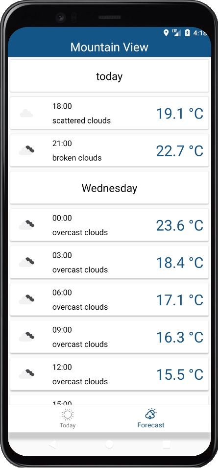

This Application able look the weather today and next 5 days. 
I used MVVM and so application has: 
Activity which showed navigation and showed permission location dialog 
ActivityViewModel which saved location in AppSettings. 

2 Screen which showed informations about weather in your location. 

 

ViewModels transmitted information for screens 
Repository which created requests at open API and processed answers. 
All components link with using Koin
